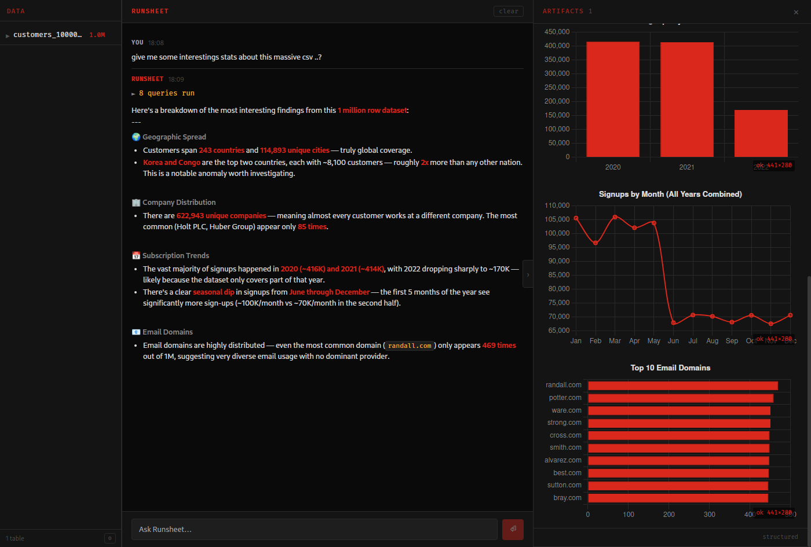

# Runsheet

**AI-powered data analysis for your desktop.** Drop a file, ask a question, get answers — backed by DuckDB for column-store performance on hundreds of millions of rows.



---

## What it does

Runsheet is a native desktop app that lets you load data files and have a conversation with them. The AI can write and execute SQL automatically, produce charts, tables, and summaries, and navigate large document collections with precision.

## Why it's fast

The query engine is [DuckDB](https://duckdb.org/) — a columnar OLAP database that runs entirely in-process. No server. No network overhead. DuckDB routinely processes **hundreds of millions of rows in seconds** on a laptop, using vectorised execution and multi-core parallelism. Runsheet inherits all of that for free.

## Features

- **Drag-and-drop ingestion** — CSV, TSV, Excel (XLSX/XLS), Parquet, PDF
- **Millions of rows** — DuckDB handles it without breaking a sweat
- **Multi-provider AI** — Anthropic (Claude), OpenAI (GPT), Mistral; live `/models` endpoint so you always see current models
- **PDF intelligence** — PDFium-backed text extraction (kreuzberg) + bookmark/outline index table for precise page navigation
- **AI artifacts** — charts, data tables, metric cards, and dashboards rendered natively alongside the conversation
- **Resizable panels** — drag the data panel to your preferred width
- **Fully offline** — your data never leaves your machine; only the AI prompt goes to the cloud

## Getting started

1. Download the installer for your platform from [Releases](../../releases)
2. Open Runsheet and click **⚙ Settings** to add your API key
3. Drop a data file onto the window
4. Ask a question

## Supported file types

| Format | Notes |
|--------|-------|
| `.csv` / `.tsv` | Any delimiter, auto-detected schema |
| `.xlsx` / `.xls` | All sheets ingested as separate tables |
| `.parquet` | Columnar — fastest load for large datasets |
| `.pdf` | Text extraction per page + bookmark index |

## Building from source

**Prerequisites:** Rust, Node.js 20+, platform WebView (WebKit2GTK on Linux, WebView2 on Windows, built-in on macOS)

```bash
npm install
npm run tauri build
```

Binaries land in `src-tauri/target/release/bundle/`.

## Development

```bash
npm run tauri dev
```

## License

MIT
